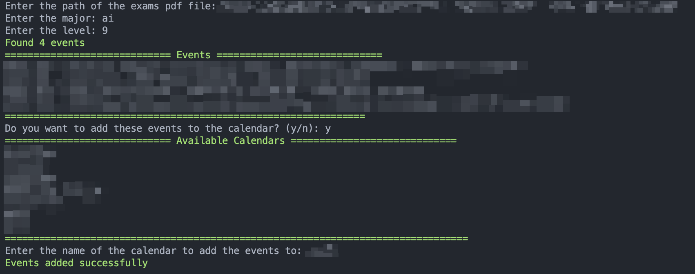

# Calendar Automation for IAU exams

This project is a simple automation for the IAU exams calendar. It is written in Python and uses the Google Calendar API to create events in the calendar.

## Installation

### Clone The Repository

```bash
git clone <repo-url>
```

### Install Dependencies

```bash
pip install -r requirements.txt
```

### Install GhostScript

you can install GhostScript from [here](https://ghostscript.com/releases/gsdnld.html)

### Setup Google Calendar API (OPTIONAL)

1. Create a new project in the Google Cloud Console and enable the Google Calendar API
2. Download the credentials.json file and place it `secrets/credentials.json`
3. Run the script

if you don't want to use the Google Calendar API, you can simply run the script and it will generate the events in a `calendar.ics` file

Follow [this](https://developers.google.com/calendar/api/quickstart/python) guide to quickstart the Google Calendar API

## Example Run

```bash
python main.py
```


